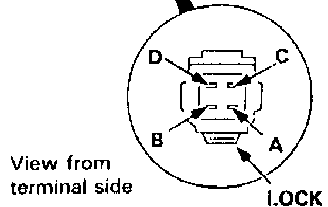
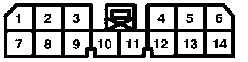

# Body Connectors (Group 400)

## Grounds
### [G301](#g301)
In Engine Bay - Front Driver side, behind headlight

## Cruise Control
### [C308](#c308) (Actuator)
4-pin 2-row, Gray, Bottom tab lock.  

| Pin # | Color      | Function               | To Conn/Pin |
|-------|------------|------------------------|-------------|
| A     | BLK        | Ground/Safety Solenoid | [G301](#g301)        |
| B     | BRN        | Vacuum Solenoid        | C324/P2     |
| C     | BRN/BLK    | Vent Solenoid          | C324/P3     |
| D     | BRN/WHT    | Solenoid Common        | C324/P1     |

### [C477](#c477) (Module)
14-pin 2-row, Gray, Top tab lock.  

| Pin # | Color      | Function               | To Conn/Pin |
|-------|------------|------------------------|-------------|
| 1     | BRN/WHT    | CC Actuator Signal D   | C324/P1     |
| 2     | GRY        | Brake switch NC input  | C479/P1     |
| 3     | BLK        | Ground                 | G401        |
| 4     | GRN/WHT    | Brake switch NO input  | C479/P3     |
| 5     | LT GRN/RED | Set/Decel button input | C478/P6     |
| 6     | LT GRN/BLK | Resume/accel btn input | C478/P5     |
| 7     | BLU        | RPM input              |             |
| 8     | BRN/RED    | CC Actuator Signal C   | C324/P3     |
| 9     | RED        | Indicator light        | C404/P2     |
| 10    | BRN/BLK    | CC Actuator Signal B   | C324/P2     |
| 11    |            |                        |             |
| 12    | ORN        | Vehicle speed input    |             |
| 13    | LT GRN     | Power input            | C479/P4     |
| 14    | PNK        | Disengate input        | C459/P2     |